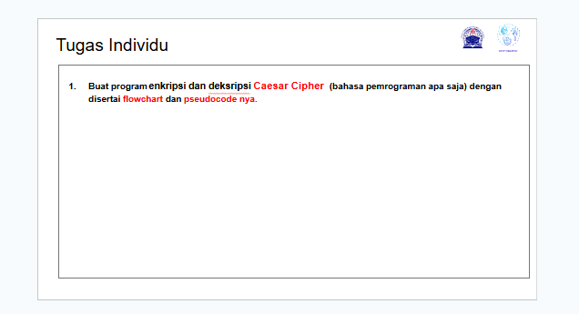
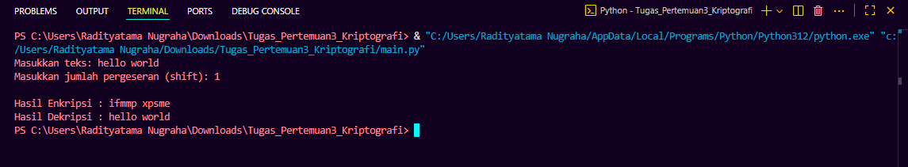
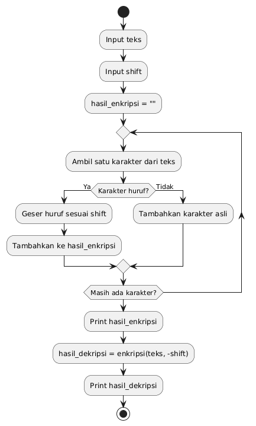

# Tugas Pertemuan 3 

|Nama|NIM|Kelas|Mata Kuliah|
|----|---|-----|------|
|**Radityatama Nugraha**|**312310644**|**TI.23.A3**|**Kriptografi**|

# Soal :



## Code Program :

```python
def enkripsi(teks, shift):
    hasil = ""
    for char in teks:
        if char.isalpha():
            kode = ord('A') if char.isupper() else ord('a')
            hasil += chr((ord(char) - kode + shift) % 26 + kode)
        else:
            hasil += char
    return hasil

def dekripsi(teks, shift):
    return enkripsi(teks, -shift)

teks = input("Masukkan teks: ")
shift = int(input("Masukkan jumlah pergeseran (shift): "))

hasil_enkripsi = enkripsi(teks, shift)
hasil_dekripsi = dekripsi(hasil_enkripsi, shift)

print("\nHasil Enkripsi :", hasil_enkripsi)
print("Hasil Dekripsi :", hasil_dekripsi)
```

## Output :



## Flowchart :



## Pseudocode :

```
START
    INPUT teks
    INPUT shift
    hasil_enkripsi = ""
    FOR setiap karakter dalam teks
        IF karakter huruf THEN
            geser posisi huruf sebanyak shift
            tambahkan ke hasil_enkripsi
        ELSE
            tambahkan karakter asli (spasi, tanda baca, dll)
        ENDIF
    ENDFOR
    PRINT hasil_enkripsi

    hasil_dekripsi = enkripsi(teks, -shift)
    PRINT hasil_dekripsi
END
```
## Penjelasan Pseudocode nya

### - Artinya program dimulai
```
START
```

### - Program meminta masukan dari pengguna, yaitu:
#### - teks = kalimat yang ingin dienkripsi, misalnya "hello world"
#### - shift = berapa huruf digeser, misalnya 1
```
INPUT teks
INPUT shift
```

### - Program menyiapkan variabel kosong untuk menampung hasil enkripsi nanti.
#### - Tanda "" berarti string kosong.
```
hasil_enkripsi = ""
```

### - Program akan memeriksa satu per satu huruf dari teks yang kamu masukkan.
#### - Misalnya teks = "hello world", 
#### - h, e, l, l, o, w, o, r, l, d
```
FOR setiap karakter dalam teks
```

### - Kalau karakter itu huruf (A–Z atau a–z), maka...
```
IF karakter huruf THEN
```

### - Huruf akan digeser sesuai jumlah shift.
### - Contoh:
#### - Huruf A digeser 1 → jadi b
#### - Huruf x digeser 3 → jadi y
#### - Lalu hasilnya ditambahkan ke teks terenkripsi.
```
geser posisi huruf sebanyak shift
tambahkan ke hasil_enkripsi
```

### - Kalau karakter bukan huruf (misalnya spasi " " atau tanda baca "!"), maka tidak diubah, cukup ditambahkan apa adanya ke hasil.
```
ELSE
    tambahkan karakter asli (spasi, tanda baca, dll)
```

### - Menandakan selesainya perulangan semua huruf dalam teks.
```
ENDFOR
```

### - Menampilkan hasil enkripsi ke layar.
```
PRINT hasil_enkripsi
```

### - Untuk mendekripsi, program memanggil fungsi enkripsi lagi, tapi arah pergeserannya dibalik (-shift), sehingga teks terenkripsi bisa dikembalikan ke semula.
```
hasil_dekripsi = enkripsi(teks, -shift)
PRINT hasil_dekripsi
```

### - Program selesai dijalankan.
```
END
```

## - Ilustrasi singkat prosesnya:
### - Input:
```
Teks   : hello
Shift  : 1
```

### - Langkah-langkah:
```
h → i
e → f
l → m
l → m
o → p
```
### - Output:
```
Hasil Enkripsi : ifmmp
Hasil Dekripsi : hello
```

